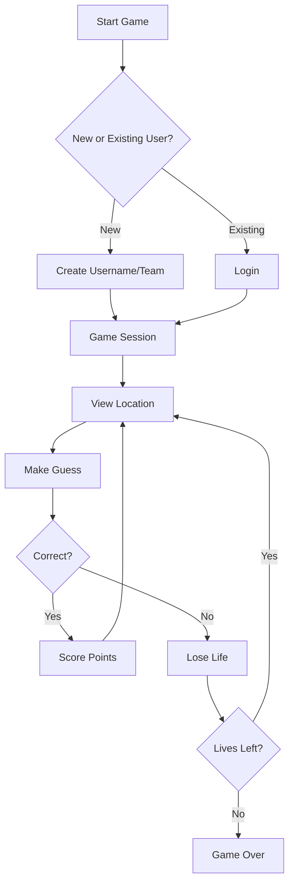
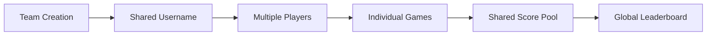

# GeoHunt 🌍

## 📑 Table of Contents
- [Overview](#overview)
- [Features](#-features)
- [How It Works](#-how-it-works)
- [Game Flow](#-game-flow)
- [Team System](#-team-system)
- [Technical Stack](#️-technical-stack)
- [Demo Video](#-demo-video)
- [Getting Started](#-getting-started)
  - [Prerequisites](#prerequisites)
  - [Installation](#installation)
- [Key Features Explained](#-key-features-explained)
  - [Team Formation](#team-formation)
  - [Gameplay Mechanics](#gameplay-mechanics)
  - [User Experience](#user-experience)
- [Mobile Support](#-mobile-support)
- [Contributing](#-contributing)
- [Acknowledgments](#acknowledgments)

## Overview
GeoHunt is an interactive geography game that combines exploration, learning, and team collaboration. Players can explore global landmarks and landscapes while competing individually or as part of a team.


## 🎮 Features

- **Team Play**: Create or join teams with shared usernames
- **Global Exploration**: Discover and learn about worldwide locations
- **Lives System**: Strategic gameplay with 5 lives per session
- **Collaborative Learning**: Share knowledge and strategies with team members
- **Real-time Leaderboard**: Track team progress globally

## 🔄 How It Works



## 🎯 Game Flow

1. **Start**: Choose between creating a new team or joining an existing one
2. **Play**: View locations and make educated guesses
3. **Score**: Earn points for correct guesses
4. **Lives**: Manage your 5 lives carefully
5. **Leaderboard**: Compare your team's performance globally

## 🤝 Team System



## 🛠️ Technical Stack

- React.js for frontend
- Tailwind CSS for styling
- Nodejs and Express for backend sever
- Used Cursor and Claude in the later stages of development

## 🎥 Demo Video

Experience GeoHunt in action:

<video width="100%" controls>
  <source src="https://drive.google.com/file/d/1-6FUfKtCGcpt550qD3TlOxR0fErqs-co/view?usp=drive_link" type="video/mp4">
  Your browser does not support the video tag.
</video>

## 🚀 Getting Started

1. Clone the repository
```bash
git clone https://github.com/vishdadhich092004/geohunt.git
```

2. Install backend dependencies
```bash
cd geohunt
cd client
npm install
```
3. Install backend dependencies
```bash
cd ..
cd server
npm install
```

5. Start the backend server
```bash
cd server 
npm run dev
```
5. Start the frontend server
```bash
cd client 
npm run dev
```

## 💡 Key Features Explained

### Team Formation
- Create unique team names
- Share credentials with team members
- Collaborative score accumulation
- Real-time progress tracking

### Gameplay Mechanics
- 5 lives per session
- Strategic guessing system
- Global location database
- Interactive map interface

### User Experience
- Smooth animations
- Intuitive controls
- Responsive design
- Real-time feedback

## 📱 Mobile Support

GeoHunt is fully responsive and works seamlessly across:
- Desktop browsers
- Tablets
- Mobile devices

## 🤝 Contributing

We welcome contributions! Please feel free to submit a Pull Request.

Thanks to my friends :)
